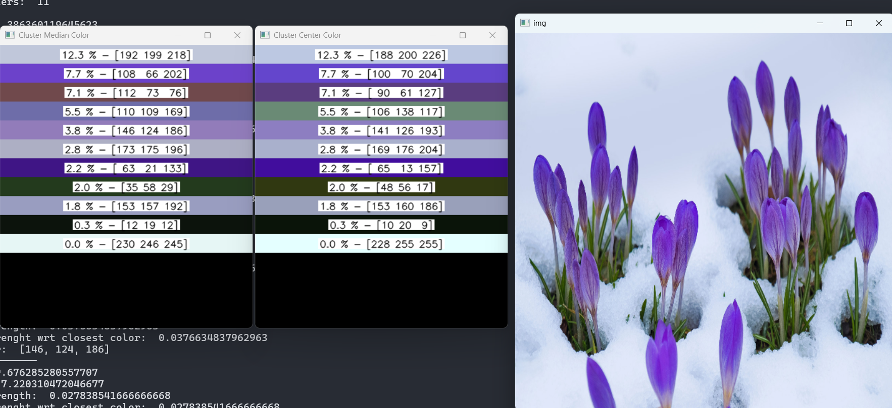

# dynamic-color-quantization
color quantization with Binary( kmeans + trees )

## How to run: 
> python dynamic_color_quantize.py 

## Example Output:

- The % tells the cluster strength (i.e number of unique colors present in that cluster out of all the unique colors)
- The 2 output images show different ways of selecting cluster color 
    - Color which is at the median point of the cluster OR
    - Color which is closest to the cluster centroid

## Process Flow: 

